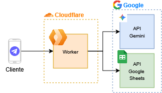

# 💰 Expense Tracker Bot

[](https://www.typescriptlang.org/)
[](https://workers.cloudflare.com/)
[](https://hono.dev/)
[](LICENSE)

Bot de Telegram para rastrear gastos automáticamente usando IA. Envía un mensaje describiendo tu gasto y el bot lo procesa, categoriza y guarda en Google Sheets.

## ✨ Características

- 🤖 **IA Integrada**: Utiliza Google Gemini 2.5 Flash para interpretar mensajes en lenguaje natural
- 📸 **Escaneo de Recibos**: Procesa imágenes de tickets y facturas automáticamente
- 📊 **Google Sheets**: Almacena todos tus gastos en una hoja de cálculo organizada
- 🏷️ **Categorización Inteligente**: Clasifica gastos en needs/wants/savings automáticamente
- ⚡ **Cloudflare Workers**: Infraestructura serverless ultra-rápida y escalable (<50ms de latencia)
- 🔒 **Seguro**: Verificación de tokens, autenticación de webhooks y control de acceso por usuario
- 🌐 **TypeScript**: Code base completamente tipado para máxima confiabilidad
- 🆓 **Tier Gratuito**: Funciona completamente en planes gratuitos de Cloudflare y Google

## 🏗️ Arquitectura



## 📋 Requisitos

- [Bun](https://bun.sh/) 1.0+
- Cuenta de Cloudflare (plan gratuito funciona)
- Bot de Telegram (crear con [@BotFather](https://t.me/botfather))
- Google Cloud Project con Sheets API habilitada
- Google Gemini API Key

## 🚀 Instalación

### 1. Clonar el repositorio

```bash
git clone https://github.com/SrUltraLord/expense-tracker.git
cd expense-tracker
bun install
```

### 2. Configurar Google Cloud

1. Ve a [Google Cloud Console](https://console.cloud.google.com)
2. Crea un nuevo proyecto
3. Habilita Google Sheets API
4. Crea una Service Account y descarga las credenciales JSON
5. Crea una Google Sheet y compártela con el email de la Service Account

### 3. Obtener API Keys

- **Telegram Bot Token**: Habla con [@BotFather](https://t.me/botfather) y ejecuta `/newbot`
- **Gemini API Key**: Ve a [Google AI Studio](https://aistudio.google.com/apikey)

### 4. Configurar Secrets en Cloudflare

```bash
# Token del bot de Telegram
bunx wrangler secret put TELEGRAM_BOT_TOKEN

# API Key de Google Gemini
bunx wrangler secret put GEMINI_API_KEY

# Credenciales de Google Service Account (todo el JSON en una línea)
bunx wrangler secret put GOOGLE_SERVICE_ACCOUNT_CREDENTIALS

# ID de tu Google Spreadsheet (obtenerlo de la URL)
bunx wrangler secret put GOOGLE_SPREADSHEET_ID

# Token secreto para verificar webhooks (genera uno aleatorio)
bunx wrangler secret put SECRET_TOKEN

# IDs de chat autorizados - opcional (separados por comas: 123456789,987654321)
# Si no se configura, cualquiera puede usar el bot
bunx wrangler secret put ALLOWED_CHAT_IDS
```

### 5. Configurar el Webhook de Telegram

Una vez desplegado, configura el webhook:

```bash
curl -X POST "https://api.telegram.org/bot<TU_BOT_TOKEN>/setWebhook" \
  -H "Content-Type: application/json" \
  -d '{
    "url": "https://expense-tracker.<tu-subdomain>.workers.dev/webhook",
    "secret_token": "<TU_SECRET_TOKEN>"
  }'
```

## 💻 Desarrollo

### Ejecutar en local

```bash
bun run dev
```

El servidor estará disponible en `http://localhost:8787`

### Generar tipos de Cloudflare

```bash
bun run cf-typegen
```

### Desplegar a producción

```bash
bun run deploy
```

## 📝 Uso

Una vez configurado, simplemente envía mensajes a tu bot de las siguientes formas:

### 💬 Mensajes de Texto

**Ejemplos:**

- "Gasté $50 en comida en el super"
- "Pagué 1200 de renta"
- "30 dólares en uber"
- "Compré café por $5"
- "Almuerzo 15 USD"
- "Cena en restaurante 45 dólares"

### 📸 Imágenes de Recibos

Envía una foto del ticket o factura y el bot extraerá:

- Monto total
- Fecha de compra
- Descripción del establecimiento
- Categoría apropiada

**Tip:** Puedes añadir un caption a la imagen para dar contexto adicional.

### 🎯 Proceso Automático

El bot automáticamente:

1. ✅ Extrae el monto y fecha
2. ✅ Identifica la categoría (needs/wants/savings)
3. ✅ Asigna subcategoría (supermercado, transporte, etc.)
4. ✅ Guarda en Google Sheets
5. ✅ Te confirma el registro con un resumen

## 🗂️ Estructura del Proyecto

```
expense-tracker/
├── src/
│   ├── index.ts              # Entry point (Hono app)
│   ├── types.ts              # TypeScript types
│   ├── handlers/
│   │   ├── index.ts          # Exports
│   │   └── expenses-handler.ts  # Webhook handler
│   ├── middlewares/
│   │   └── index.ts          # Secret token verification
│   ├── services/
│   │   ├── gemini.ts         # Google Gemini integration
│   │   ├── google-sheets.ts  # Google Sheets API
│   │   └── telegram.ts       # Telegram Bot API
│   ├── utils/
│   │   ├── encoding-utils.ts # Base64 encoding
│   │   └── jwt-utils.ts      # JWT verification
│   └── assets/
│       └── prompt.md         # AI prompt template
├── package.json
├── tsconfig.json
├── wrangler.jsonc            # Cloudflare config
└── README.md
```

## 🔧 Variables de Entorno

| Variable                             | Descripción                                                     | Requerido |
| ------------------------------------ | --------------------------------------------------------------- | --------- |
| `TELEGRAM_BOT_TOKEN`                 | Token del bot de Telegram                                       | ✅        |
| `GEMINI_API_KEY`                     | API key de Google Gemini 2.5 Flash                              | ✅        |
| `GOOGLE_SERVICE_ACCOUNT_CREDENTIALS` | Credenciales JSON completas de Google Service Account           | ✅        |
| `GOOGLE_SPREADSHEET_ID`              | ID de la hoja de cálculo (de la URL)                            | ✅        |
| `SECRET_TOKEN`                       | Token secreto para verificar webhooks (genera uno aleatorio)    | ✅        |
| `ALLOWED_CHAT_IDS`                   | IDs de usuarios autorizados separados por comas (ej: `123,456`) | ❌        |

> **Nota:** Si no configuras `ALLOWED_CHAT_IDS`, cualquier usuario podrá usar tu bot.

## 🏷️ Categorización de Gastos

El bot categoriza automáticamente tus gastos usando el método 50/30/20:

### 📌 **Needs** (Necesidades - 50%)

Gastos esenciales para vivir:

- 🍽️ Alimentación básica (supermercado, mercado)
- 🏠 Vivienda (renta, hipoteca, servicios)
- 🚌 Transporte esencial (gasolina, transporte público)
- 💊 Salud (medicamentos, consultas)
- 📚 Educación

### 🎯 **Wants** (Deseos - 30%)

Gastos no esenciales que mejoran tu calidad de vida:

- 🍕 Restaurantes y delivery
- ☕ Cafeterías
- 🎬 Entretenimiento (cine, conciertos)
- 👕 Ropa no esencial
- 📺 Suscripciones (Netflix, Spotify)

### 💰 **Savings** (Ahorros - 20%)

Inversiones y ahorro:

- 📈 Inversiones
- 🏦 Ahorro formal
- 🚨 Fondos de emergencia

## 🛠️ Tecnologías

- [Hono](https://hono.dev/) - Framework web ultrarrápido para Edge Computing
- [Cloudflare Workers](https://workers.cloudflare.com/) - Plataforma serverless global
- [Google Gemini 2.5 Flash](https://ai.google.dev/) - Modelo de IA para procesamiento de lenguaje natural e imágenes
- [Google Sheets API](https://developers.google.com/sheets/api) - Almacenamiento estructurado de datos
- [Telegram Bot API](https://core.telegram.org/bots/api) - Interfaz conversacional
- [TypeScript](https://www.typescriptlang.org/) - Lenguaje de programación tipado
- [Bun](https://bun.sh/) - Runtime y package manager ultra-rápido

## 📄 Licencia

MIT

## 🗺️ Roadmap

- [ ] Comandos del bot (`/stats`, `/export`, `/cancel`)
- [ ] Alertas de presupuesto

## 🤝 Contribuir

Las contribuciones son bienvenidas. Por favor:

1. Fork el proyecto
2. Crea una rama para tu feature (`git checkout -b feature/AmazingFeature`)
3. Commit tus cambios (`git commit -m 'Add some AmazingFeature'`)
4. Push a la rama (`git push origin feature/AmazingFeature`)
5. Abre un Pull Request

## 📧 Contacto

- David Reyes - [@SrUltraLord](https://github.com/SrUltraLord)
